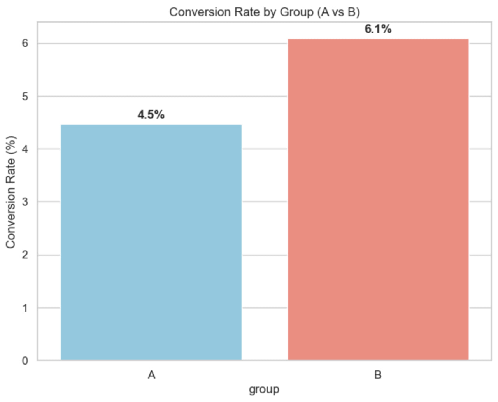
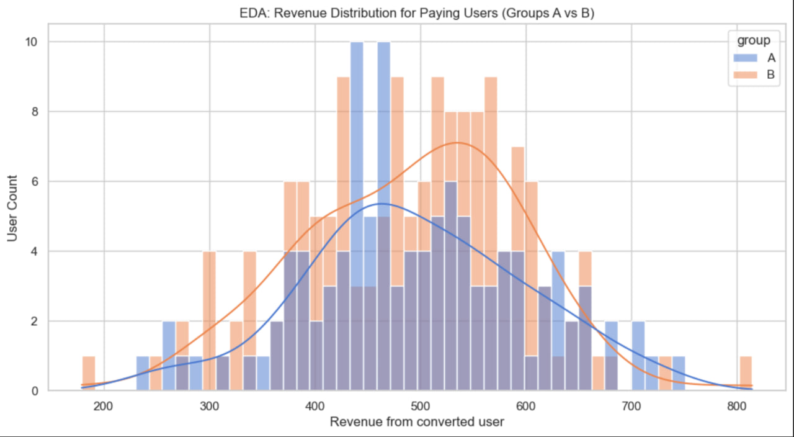
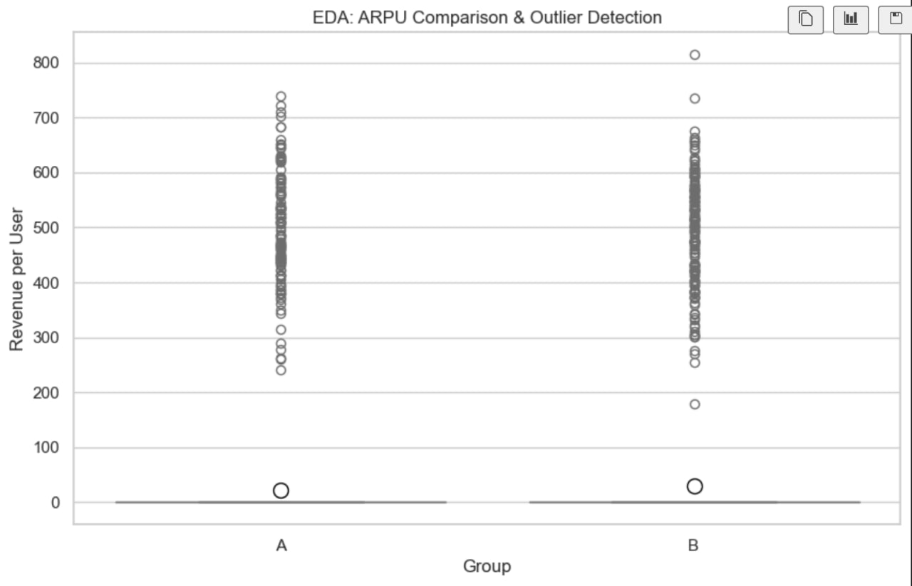
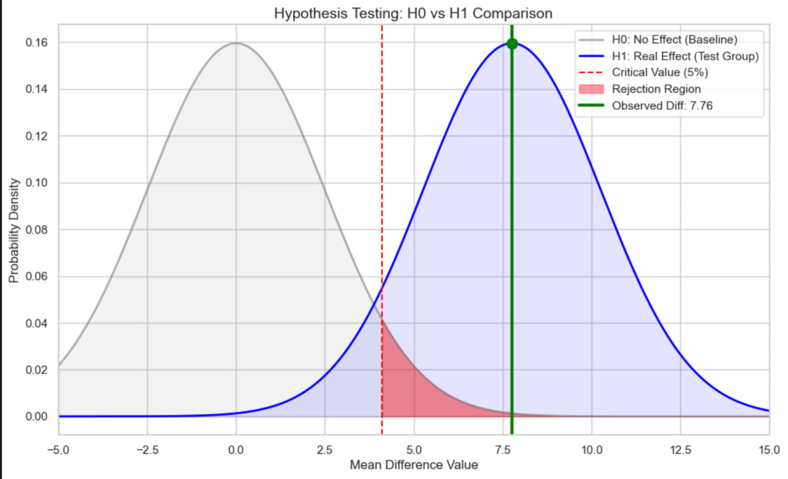

# SaaS Pricing Optimization: Statistical A/B Test Analysis 🚀

## 📌 Project Overview
This project evaluates a pricing strategy change for a subscription-based product. The goal was to determine if the new pricing model (**Group B**) significantly improved **ARPU (Average Revenue Per User)** compared to the current model (**Group A**).
The growth in ARPU was primarily driven by a significant 1.6 percentage point lift in conversion rates (from 4.5% to 6.1%).

The analysis covers the entire pipeline: from data simulation and distribution analysis to rigorous hypothesis testing and advanced bootstrapping techniques.

### 📈 Conversion Lift at a Glance

*Visual confirmation of the 1.6 percentage point increase in conversion rates, which served as the primary driver for ARPU growth.*

---

## 🛠️ Tech Stack
* **Python (Pandas, NumPy):** Data manipulation and simulation.
* **SciPy & Statsmodels:** Statistical hypothesis testing.
* **Matplotlib & Seaborn:** Data visualization and EDA.
* **Bootstrapping:** Advanced non-parametric estimation of confidence intervals.

---

## 📊 Methodology
1.  **Exploratory Data Analysis (EDA):**
    * Analyzed revenue distributions and conversion rates using:
    * **Histogram** 
    * **Boxplot** 
    * **Shapiro-Wilk Test:** Formally checked for normality to justify the choice of statistical tests (confirmed non-normal distribution for total revenue).
2.  **Statistical Hypothesis Testing:**
    * **Z-test:** Compared conversion rates between groups to identify shifts in user behavior.
    * **Mann-Whitney U-test:** Performed a robust non-parametric comparison of revenue.
    * **Welch’s T-test:** Conducted as a baseline parametric comparison for completeness.
3.  **Bootstrapping (10,000 iterations):**
    * Created a distribution of mean differences to calculate the **95% Confidence Interval**, providing a high-confidence estimation of the pricing impact.
    * **Hypothesis H0 vs H1 Comparison**

---

## 🚀 Key Results & Business Impact
* **Mean Difference in ARPU:** **+7.76**
* **95% Confidence Interval:** **[1.52, 14.00]**
* **Statistically Significant:** Yes, as the confidence interval stays entirely above zero.

> ### 💡 Final Recommendation
> **Roll out Group B to 100% of users.** The analysis proves a statistically significant revenue increase, minimizing the risk of a false positive decision and confirming a reliable lift in conversion.

---

## 📂 File Structure
* `ab_test_pricing_analysis.ipynb` — Full research notebook containing data generation, EDA, statistical tests, and final interpretations.
